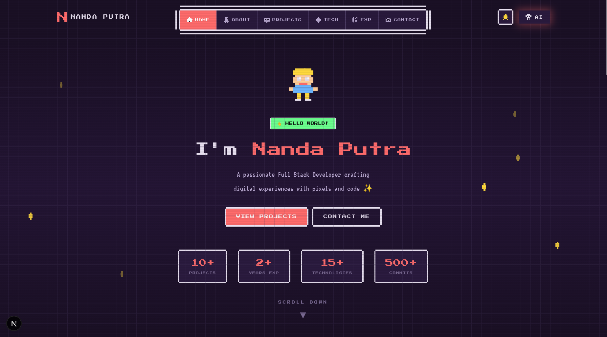

# 🎮 Nanda Putra - Pixel Portfolio

Welcome to my digital playground! This is a personal portfolio website built with a **modern tech stack** and a **retro pixel-art aesthetic**. It's designed to feel like a classic RPG game interface while showcasing my professional journey, projects, and skills.


## ✨ Features

- **🕹️ Retro UI/UX**: Custom-built pixel borders, buttons, and layouts using vanilla CSS shadows.
- **✨ Smooth Animations**: Dynamic "Opening Pill" navbar and hover effects that feel alive.
- **📱 Responsive Layout**: Fully optimized for mobile with a dedicated bottom-docked navigation bar.
- **🌗 Theme Toggle**: Switch between Dark and Light modes with pixel-perfect icon transitions.
- **🤖 AI Integration**: Built-in AI assistant helper (coming soon/integrated).
- **🗺️ Interactive Journey**: Explore my experience and projects through a structured, game-like map.

## 🛠️ Tech Stack

- **Framework**: [Next.js 15](https://nextjs.org/) (App Router)
- **Styling**: [Tailwind CSS v4](https://tailwindcss.com/) & Vanilla CSS
- **Language**: [TypeScript](https://www.typescriptlang.org/)
- **Icons**: Custom Pixel SVG Icons & Emojis
- **Fonts**: Custom Pixel Heading Fonts

## 🚀 Getting Started

First, run the development server:

```bash
npm install
npm run dev
# or
yarn dev
# or
pnpm dev
```

Open [http://localhost:3000](http://localhost:3000) with your browser to see the result.

## 👤 About Me

Hi! I'm **Nanda Putra**, a passionate developer who loves blending creativity with code. I specialize in building web applications that not only work perfectly but also provide a unique visual experience. This portfolio is a reflection of my love for retro aesthetics and modern performance.

---

## 📸 Screenshots



- **Hero Section**: A grand entrance with a "Level Up" feel.
- **Navbar**: The centerpiece of the site with horizontal opening animations.
- **Project Cards**: Retro-styled cards showcasing my latest work.

---

## ✉️ Contact

Feel free to reach out if you want to collaborate on a project or just say hi!

- **Email**: [nandaputrah235@gmail.com](mailto:nandaputrah235@gmail.com)
- **GitHub**: [@nandaputrahartono-pc](https://github.com/nandaputrahartono-pc)
- **Instagram**: [@nanda_putra324](https://www.instagram.com/nanda_putra324/)

---

*Built with 💖 and a lot of pixels by Nanda Putra.*
